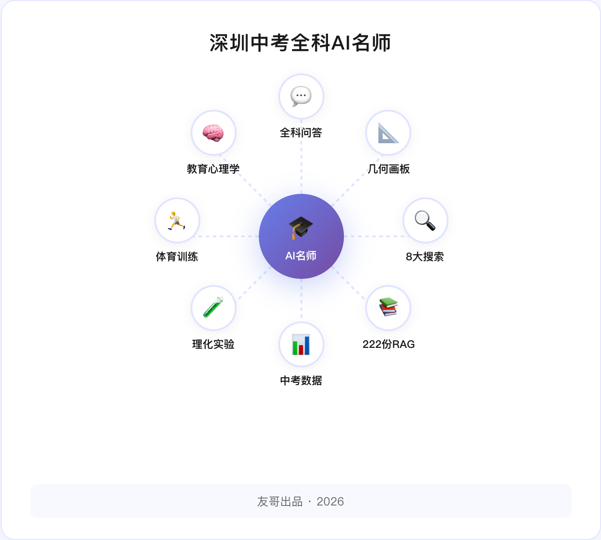
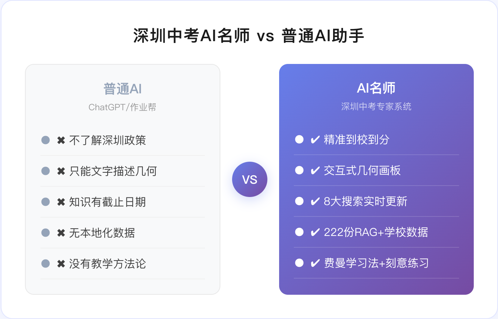
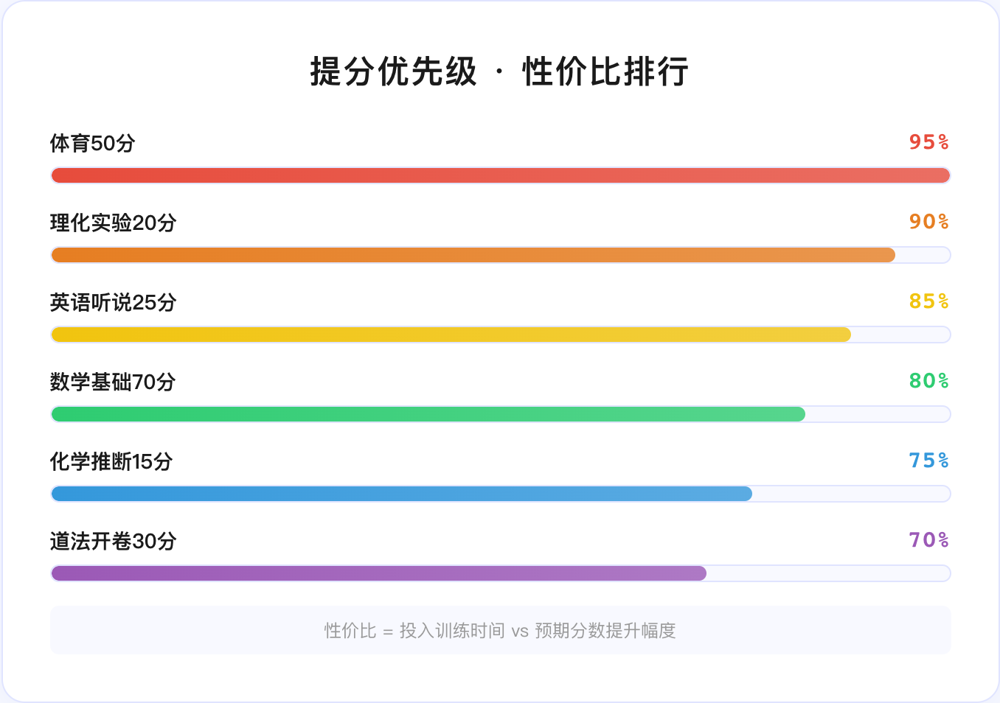
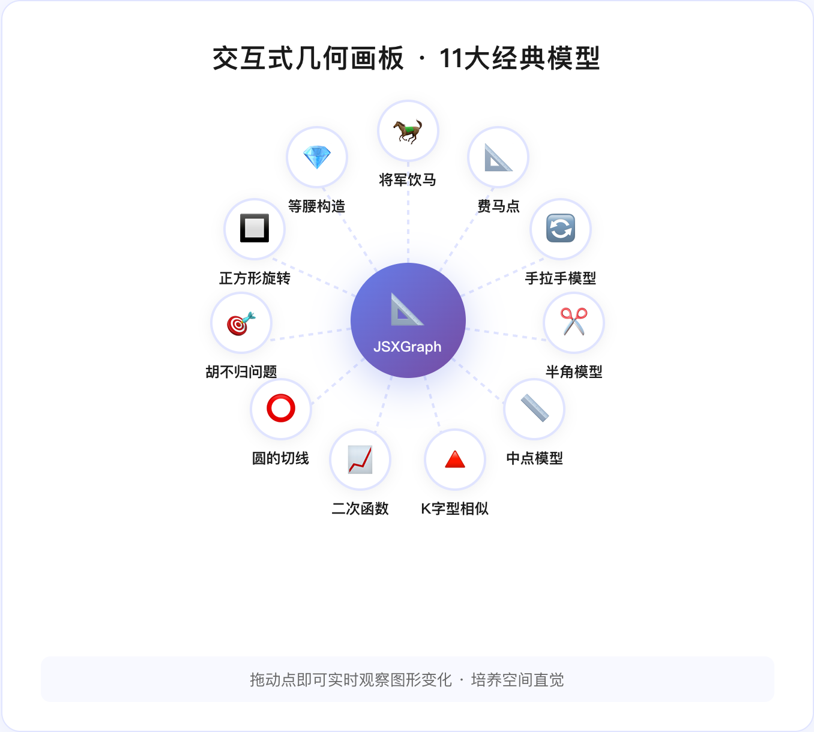
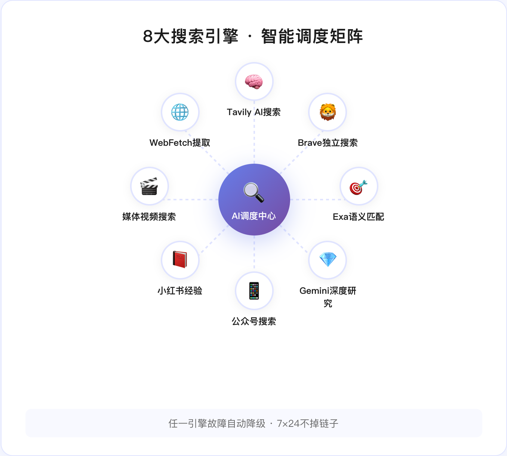
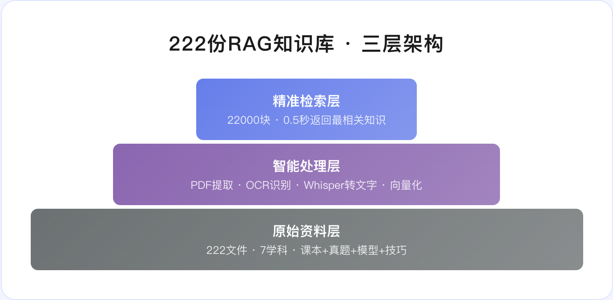
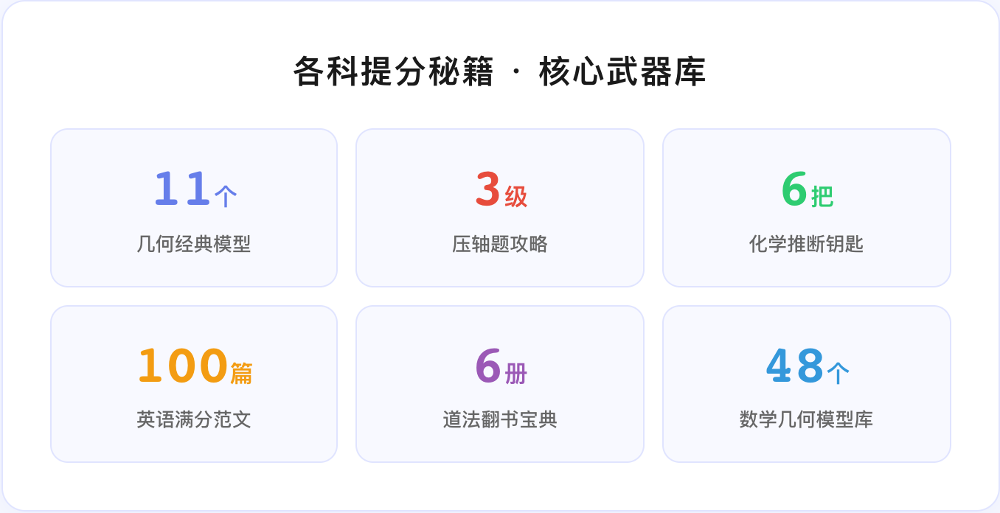
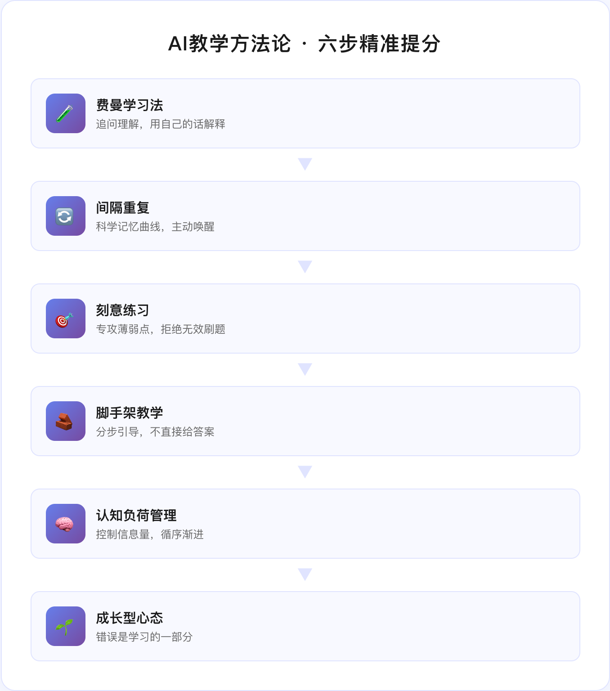

# 我用Claude造了个中考AI老师，比培训班还猛

{{LEAD}}
630分的中考赛场，每一分都是战场。我用 Claude Opus 4.6 + 8 大搜索引擎 + 222 份学科资料 + 交互式几何画板，打造了一个免费的「深圳中考全科AI名师」系统。它不但会解题、会画图、会搜索，还掌握费曼学习法、间隔重复、刻意练习等顶级教学心法——说白了，我想让它比任何培训老师都强。
{{/LEAD}}

## 一、一个爸爸的焦虑

我家孩子明年中考。

630分，八大科目，体育实验一分不能少。

培训班一对一，400块一小时，效果？看运气。

**有没有可能，造一个24小时在线、精通全科、还免费的超级老师？**

作为一个搞AI的程序员爸爸，我决定自己动手。

不是玩票，是真刀真枪地干——花了整整一个月，从系统架构到知识库，从教学心法到答题模板，每一行代码都是为了让孩子多拿几分。

今天，这个系统已经能用了。

## 二、这个系统到底有多强？

先上一张全景架构图，看看这个「深圳中考全科AI名师」到底塞了多少料：

**三层架构，六大模块：**

- 💬 **全科AI问答**：Claude Opus 4.6 驱动，200K上下文，数学证明、物理电学、化学推断、英语语法——通吃
- 📐 **交互式几何画板**：JSXGraph 引擎，将军饮马、费马点、手拉手模型，不是看图片，是**真的能拖着点动的**
- 🔍 **8大搜索引擎**：Tavily + Brave + Exa语义 + Gemini Deep Research + 公众号 + 小红书 + 媒体搜索 + WebFetch
- 📚 **222份RAG知识库**：七大学科22000个知识块，覆盖课本、真题、模型、技巧
- 📊 **中考数据中心**：深圳92所公办+47所民办+16所中职，精准到校到分
- 🧪 **理化实验专区**：2026年新增20分硬分数的操作指南

**一句话总结：它不是ChatGPT套个壳，是一个为深圳中考量身定制的超级教学系统。**

## 三、核心武器一：Claude Opus 4.6 驱动的全科AI教师

这不是一个"你问什么我答什么"的简单问答机器人。

我在 System Prompt 里塞了**整整710行**的教学指令——从2026年中考改革细则（630分制、道法开卷、理化实验20分），到每个科目的高频考点、答题模板、易错警告。

**它懂教育心理学：**

- 🧪 **费曼学习法**：不只给你答案，还会追问"你能用自己的话解释吗？"
- 🔄 **间隔重复**：主动提醒"上次讲的公式你还记得吗？"
- 🎯 **刻意练习**：做对了不废话直接进下一个挑战，做错了深挖错因
- 🧱 **脚手架教学**：压轴题不直接给答案，先问"你能做到哪一步？"

**它懂提分策略：**

| 优先级 | 科目 | 理由 |
|--------|------|------|
| ⭐⭐⭐⭐⭐ | 体育50分 | 纯训练型，练就有分 |
| ⭐⭐⭐⭐⭐ | 理化实验20分 | 操作规范即满分 |
| ⭐⭐⭐⭐ | 英语听说25分 | 反复练习即可22+ |
| ⭐⭐⭐⭐ | 数学基础70分 | 保住基础=保住70分 |

**说白了，它不是在教书，是在帮孩子"算计"每一分怎么拿最划算。**

## 四、核心武器二：交互式几何画板——看得见、摸得着的数学

这是我最骄傲的功能。

普通的AI，你问它几何题，它给你一段文字描述。

**我的系统，直接画出来，还能拖着玩。**

**技术方案：JSXGraph + Canvas 双引擎**

- 将军饮马：拖动P点，实时看 PA+PB 的长度变化
- 费马点：三个点的夹角实时计算
- 胡不归：不同速度比下的最优路径
- 手拉手模型：旋转变换的直观感受
- 二次函数：a、b、c参数拖拽，图像即时变化

**为什么这很重要？**

因为数学几何是深圳中考的**拉分题**。

选择填空的前几道送分，压轴题的后两问拉分。而几何题的关键是**空间直觉**——这种直觉靠刷题刷不出来，但靠"拖着点玩"可以。

当孩子亲手拖动P点，看到PA+PB从20变到15再变到最小值12.5的过程，**他就真的理解了"两点之间线段最短"**。

这比老师在黑板上画100遍都管用。

## 五、核心武器三：8大搜索引擎——知识永远是最新的

大模型最大的问题是什么？**知识有截止日期。**

ChatGPT不知道2026年深圳中考改了什么，也不知道今年哪个区的模拟卷出了什么新题型。

所以我给系统接了**8个搜索引擎**：

| 引擎 | 特长 | 调用场景 |
|------|------|---------|
| Tavily | AI优化结果 | 通用知识搜索 |
| Brave | 独立搜索 | 政策新闻 |
| Exa | 语义匹配 | 深层学术内容 |
| Gemini Deep | 多步研究 | 复杂政策解读 |
| 公众号搜索 | 多引擎综合 | 教育类深度文章 |
| 小红书 | 学生视角 | 真实备考经验 |
| 媒体搜索 | 视频/图片 | 教学视频推荐 |
| WebFetch | 网页提取 | 全文获取 |

**智能调度策略：**

- 学生问"解题方法"→ 调 Tavily + Exa（语义搜索优先）
- 学生问"最新政策"→ 调 Tavily + Brave（双引擎交叉验证）
- 学生问"学习方法"→ 调小红书 + Tavily（学生视角优先）

任何一个引擎挂了，自动降级到备选链。**保证7×24小时不掉链子。**

## 六、核心武器四：222份RAG知识库——比老师备课还全

这可能是全深圳最全的中考电子资料库了。

**222个文件，覆盖7个学科，总量超过2GB：**

- 📐 **数学**：初中几何48模型、手拉手半角模型、深圳各区模拟卷、二次函数综合测试
- 📖 **语文**：一轮复习通关笔记（93MB）、古诗词鉴赏速通攻略、阅读大招通览
- 🔤 **英语**：满分范文100篇（196MB）、1900词速刷、完形/语法/阅读专项、32个英语视频
- ⚡ **物理**：复习百科全书、实验破解秘籍、公式速记表
- 🧪 **化学**：知识总结基础版/背诵版/提升版、化学思维导图
- ⚖️ **道法**：翻书宝典（七上到九下6册）、答题模板、时政热点
- 📜 **历史**：专题复习资料集

**不是扔进去就完了。**

每个文件都经过预处理：PDF提取文本→智能分块→向量化→存入ChromaDB。43张语法图片用OCR识别，32个英语视频用Whisper转文字。

**最终形成22000个精准检索块，学生问什么，0.5秒内找到最相关的知识。**

## 七、核心武器五：各科提分秘籍——培训班不会教你的

光有知识还不够。

**我把顶级培训机构的「提分技巧」全塞进了系统。**

### 数学：11个几何模型 + 压轴题三级攻略

| 模型 | 核心思路 |
|------|---------|
| 手拉手 | 构造全等，用SAS |
| 半角 | 旋转变换，构造等腰 |
| 将军饮马 | 做对称点连线 |
| 中点模型 | 中位线/倍长中线 |
| K字型 | 相似或全等 |

压轴题攻略：**第一问必拿（4-6分）→ 第二问争取 → 第三问写过程拿步骤分。**

### 英语：听说满分攻略

- 三遍跟读法：听→小声跟→大声读
- 转述人称模板："Could you please tell me + 疑问词 + 陈述语序"
- 完形填空三遍法：通读→逐空填→代入验证

### 化学：推断题六把钥匙

黑色固体？CuO、MnO₂、C。蓝色溶液？含Cu²⁺。白色沉淀不溶于酸？BaSO₄、AgCl。

**颜色定物质，这就是做推断题的最快路径。**

### 道法：开卷考试神器

2026年道法改开卷了，但别高兴太早——翻书太慢=做不完。

系统教学生**考前做课本索引**：用A4纸列出每课核心观点+页码，红色便利贴标必考点。

**开卷考拼的不是记忆，是"翻书速度"。**

## 八、不只是工具，更是一套教育方法论

这个系统最让我满意的，不是那些技术参数。

**而是它会"教"。**

- 学生说"我不会" → 它不说答案，而是问"你能做到哪一步？"
- 学生说"太难了" → 它说"第一问其实很简单，我们从这里切入"
- 学生做错了 → 它先诊断是概念错误、计算错误、还是审题错误，再开药方
- 学生焦虑了 → "深呼吸。中考不是一锤定音，你已经比昨天进步了"

**费曼说过：如果你不能简单地解释一个概念，说明你还没真正理解它。**

这个系统就是费曼法则的实践者——它永远在追问学生"你真的理解了吗"，而不是急着把答案塞给你。

## 九、完全免费，开箱即用

最后说一个关键信息：**这个系统完全免费。**

- 不用报班、不用买课、不用付费订阅
- PC端打开浏览器就能用
- 所有知识库、所有教学策略、所有提分秘籍，全部内置
- 唯一的成本是 Venus 内部平台的 API 调用——对我们来说，也是免费的

我做这个系统的初心很简单：

**每个孩子都应该有一个好老师。**

不是每个家庭都请得起一对一。但AI可以让优质教育触手可及。

---

> **630分的赛场上，最大的竞争力不是刷更多的题，而是找到最高效的学习方式。这个AI老师，就是我给孩子找到的"外挂"。**

如果你也有即将中考的孩子，欢迎关注我，后续会持续分享这个系统的使用心得和升级动态。

**每一分，都不该浪费。** 🎯

[^1]: 深圳市教育局《2026年中考改革方案》
[^2]: 2026年深圳中考总分630分：语文120+数学100+英语100+物理化学合卷+历史道法合卷+理化实验20+体育50
[^3]: Venus 大模型平台：http://v2.open.venus.oa.com
